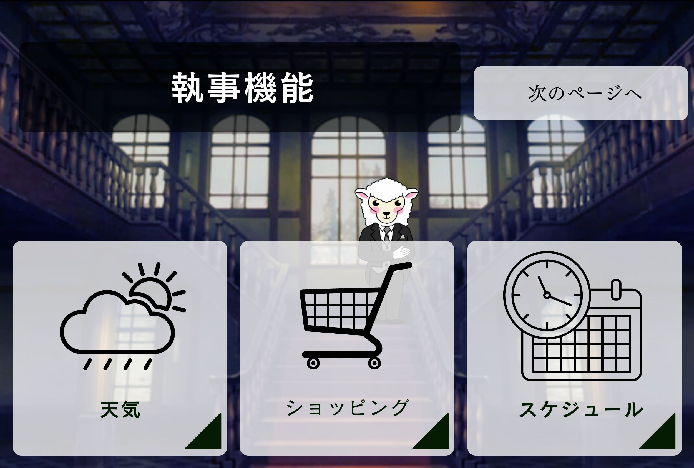
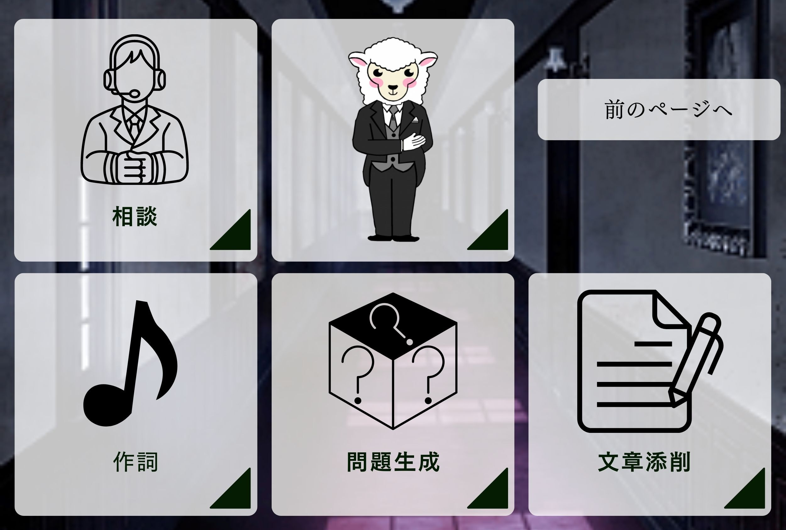
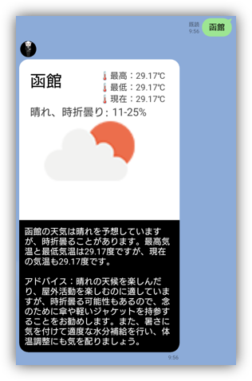
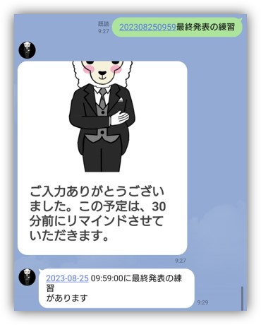

 
  

<h1 align="center"> しつじのジョーン </h1>
<h3 align="center">　2weekインターンシップ　～TDCソフト株式会社～</h3>

 
  

 
  

## はじめに
執事のジョーンは、さまざまな便利な機能をまとめたLINE BOTです。天気やショッピング、スケジュール管理などの機能に加えて、相談や作詞、問題作成、文章添削などのユニークな機能をLINEで使うことができます。執事のようなしゃべり方をする「しつじのジョーン」があなたのお手伝いをします。

## アプリの概要
### 主要機能
- 天気機能：全国約1,400の市区町村における天気や気温が調べられます。天気によって適切な服装や必要なものなどをアドバイスします。天気によって表示される画像が変化します。

 
  

- ショッピング機能：料理に必要な材料とその商品のリンクを教えてくれます。ファッションコーデからそれに関連した商品リンクを教えてくれます。

 
  

- スケジュール管理機能：日時と予定を入力すると、30分前に通知してくれます。

 
  

### その他の機能
- 相談機能：気軽に相談できます。
- 作詞機能：すぐに作詞してくれます。
- 問題作成機能：勉強したいときに使えます。
- 文章添削機能：文章を直してくれます。

### 使い方
- 画面下のメニューをタップします。
- 使いたい機能のボタンをタップします。
- それぞれの機能の指示に従って入力します。

### 使用した主な技術
- Amazon Simple Storage Service
- AWS Lambda - 
- Messaging API
- OpenAI API
- Open Weather Map API
- 楽天商品検索API
